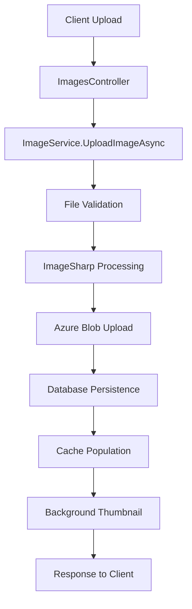
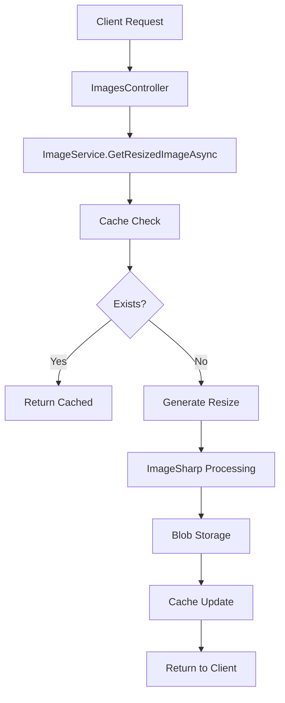

# Image API Architecture Documentation

## 📋 Table of Contents
- [Overview](#overview)
- [Architecture Patterns](#architecture-patterns)
- [Layer Breakdown](#layer-breakdown)
- [Core Components](#core-components)
- [Data Flow](#data-flow)
- [Design Decisions](#design-decisions)
- [Challenges & Solutions](#challenges--solutions)
- [Performance Optimizations](#performance-optimizations)
- [Future Considerations](#future-considerations)

## 🏗️ Overview

The Image API follows **Clean Architecture** principles with a layered approach that separates concerns and maintains dependency inversion. The solution is designed for scalability, maintainability, and performance in handling image upload, storage, and dynamic resizing operations.

## 🎯 Architecture Patterns

### Clean Architecture
```
┌─────────────────────────────────────────────────────────┐
│                    Presentation Layer                   │
│                 (ImageApi/Controllers)                  │
├─────────────────────────────────────────────────────────┤
│                   Application Layer                     │
│              (Application/Services)                     │
├─────────────────────────────────────────────────────────┤
│                 Infrastructure Layer                    │
│           (Infrastructure/Data & Storage)               │
├─────────────────────────────────────────────────────────┤
│                     Domain Layer                        │
│                 (Domain/Entities)                       │
└─────────────────────────────────────────────────────────┘
```

### Key Patterns Implemented
- **Repository Pattern** - Data access abstraction
- **Dependency Injection** - Loose coupling and testability
- **Service Layer Pattern** - Business logic encapsulation
- **DTO Pattern** - Data transfer between layers
- **Factory Pattern** - Object creation abstraction
- **Strategy Pattern** - Multiple image processing strategies

## 🏢 Layer Breakdown

### 1. Domain Layer (`Domain/`)
**Purpose**: Core business entities and rules
```csharp
Domain/
├── Entities/
│   └── ImageInfo.cs          # Core image entity
└── [Future: ValueObjects, DomainServices]
```

**Characteristics**:
- ✅ No external dependencies
- ✅ Pure business logic
- ✅ Framework agnostic
- ✅ Highly testable

### 2. Application Layer (`Application/`)
**Purpose**: Business logic orchestration and use cases
```csharp
Application/
├── Services/
│   └── ImageService.cs       # Core business logic
├── Interfaces/
│   ├── IImageService.cs      # Service contracts
│   ├── IImageRepository.cs   # Data contracts
│   └── IAzureBlobStorageService.cs
└── DTOs/
    ├── ImageUploadResultDto.cs
    ├── ImageDownloadResultDto.cs
    └── ResolutionGenerationResultDto.cs
```

**Characteristics**:
- ✅ Orchestrates business workflows
- ✅ Depends only on Domain layer
- ✅ Defines infrastructure contracts
- ✅ Contains no implementation details

### 3. Infrastructure Layer (`Infrastructure/`)
**Purpose**: External concerns implementation
```csharp
Infrastructure/
├── Data/
│   ├── ImageDbContext.cs     # EF Core context
│   └── Repository/
│       └── ImageRepository.cs # Data access implementation
├── Storage/
│   └── AzureBlobStorageService.cs # File storage implementation
└── Config/
    └── AzureBlobSettings.cs  # Configuration models
```

**Characteristics**:
- ✅ Implements Application interfaces
- ✅ Handles external dependencies
- ✅ Database and storage concerns
- ✅ Framework-specific implementations

### 4. Presentation Layer (`ImageApi/`)
**Purpose**: HTTP API and user interface
```csharp
ImageApi/
├── Controllers/
│   └── ImagesController.cs   # REST API endpoints
├── Program.cs               # Application bootstrap
└── Properties/
    └── launchSettings.json  # Development settings
```

**Characteristics**:
- ✅ HTTP request/response handling
- ✅ Input validation and formatting
- ✅ API documentation (Swagger)
- ✅ Dependency injection configuration

## 🔧 Core Components

### ImageService.cs - The Heart of Business Logic

```csharp
public class ImageService : IImageService
{
    // Dependencies injected via constructor
    private readonly IAzureBlobStorageService _blobService;
    private readonly IImageRepository _imageRepository;
    private readonly IMemoryCache _memoryCache;
    private readonly ILogger<ImageService> _logger;
    
    // Predefined resolutions for common use cases
    private readonly Dictionary<string, (int? width, int? height)> _predefinedResolutions;
}
```

**Key Responsibilities**:
1. **Image Upload Processing**
   - File validation and format detection
   - Dimension extraction using ImageSharp
   - Blob storage coordination
   - Database persistence
   - Background thumbnail generation

2. **Dynamic Image Resizing**
   - Aspect ratio preservation
   - On-demand generation
   - Multiple resolution support
   - Caching optimization

3. **Performance Optimization**
   - Memory caching for metadata
   - Background processing for common sizes
   - Opportunistic generation strategies

### ImagesController.cs - API Gateway

```csharp
[ApiController]
[Route("api/[controller]")]
public class ImagesController : ControllerBase
{
    private readonly IImageService _imageService;
    
    // RESTful endpoints for complete CRUD operations
    // File upload/download handling
    // HTTP status code management
    // Input validation and error handling
}
```

**Key Responsibilities**:
1. **HTTP Request Handling**
   - Multipart form data processing
   - Query parameter validation
   - Route parameter binding

2. **Response Formatting**
   - Appropriate HTTP status codes
   - File streaming for downloads
   - JSON serialization for metadata

3. **API Documentation**
   - Comprehensive Swagger annotations
   - Response type definitions
   - Example usage documentation

## 🔄 Data Flow

### Upload Flow


### Resize Flow


## 🎨 Design Decisions

### 1. **ImageSharp Over System.Drawing**
**Decision**: Use ImageSharp for image processing
**Rationale**:
- ✅ Cross-platform compatibility
- ✅ Better performance and memory management
- ✅ Modern API design
- ✅ Active development and support

### 2. **Azure Blob Storage for File Storage**
**Decision**: Separate file storage from database
**Rationale**:
- ✅ Scalability for large files
- ✅ Cost-effective storage
- ✅ CDN integration possibilities
- ✅ Reduced database load

### 3. **On-Demand Resizing with Caching**
**Decision**: Generate resized images when requested, not upfront
**Rationale**:
- ✅ Storage efficiency (only generate what's needed)
- ✅ Faster upload times
- ✅ Flexible sizing options
- ✅ Background optimization for common sizes

### 4. **Memory Caching Strategy**
**Decision**: Cache metadata and blob existence checks
**Rationale**:
- ✅ Reduced database queries
- ✅ Faster blob existence validation
- ✅ Improved response times
- ✅ Configurable expiration policies

### 5. **Async/Await Throughout**
**Decision**: Fully asynchronous operations
**Rationale**:
- ✅ Better scalability under load
- ✅ Non-blocking I/O operations
- ✅ Improved resource utilization
- ✅ Modern .NET best practices

## 🚧 Challenges & Solutions

### Challenge 1: **Memory Management with Large Images**
**Problem**: Large image files could cause memory pressure during processing

**Solution Implemented**:
```csharp
// Stream-based processing to avoid loading entire file into memory
using var fileStream = file.OpenReadStream();
using var image = Image.Load(fileStream);

// Reset stream position for reuse
fileStream.Position = 0;
await _blobService.UploadAsync(storageBlobName, fileStream);
```

**Benefits**:
- ✅ Reduced memory footprint
- ✅ Better performance with large files
- ✅ Prevents OutOfMemoryException

### Challenge 2: **Cold Start Performance**
**Problem**: First image resize request was slow due to ImageSharp initialization

**Solution Implemented**:
```csharp
// Background thumbnail generation after upload
if (imageHeight >= 160)
{
    .......
        _ = Task.Run(async () => await GenerateThumbnailFromOriginalBytes(originalBytesCopy, id));
}
```

**Benefits**:
- ✅ Faster subsequent requests
- ✅ Proactive optimization
- ✅ Better user experience

### Challenge 3: **Blob Storage Performance**
**Problem**: Repeated blob existence checks were slow

**Solution Implemented**:
```csharp
private async Task<bool> ExistsWithCacheAsync(string blobPath)
{
    var cacheKey = $"{CacheKeys.BlobExistsPrefix}{blobPath}";
    
    if (_memoryCache.TryGetValue(cacheKey, out bool cachedExists))
        return cachedExists;
    
    bool actualExists = await _blobService.ExistsAsync(blobPath);
    _memoryCache.Set(cacheKey, actualExists, TimeSpan.FromMinutes(2));
    
    return actualExists;
}
```

**Benefits**:
- ✅ Reduced Azure Storage API calls
- ✅ Faster response times
- ✅ Cost optimization

### Challenge 4: **Aspect Ratio Preservation**
**Problem**: Ensuring resized images maintain proper proportions

**Solution Implemented**:
```csharp
private (int width, int height) CalculateNewDimensions(int originalWidth, int originalHeight, int? targetWidth, int? targetHeight)
{
    var aspectRatio = (double)originalWidth / originalHeight;
    
    if (targetWidth.HasValue)
    {
        var newHeight = (int)(targetWidth.Value / aspectRatio);
        return (targetWidth.Value, newHeight);
    }
    
    if (targetHeight.HasValue)
    {
        var newWidth = (int)(targetHeight.Value * aspectRatio);
        return (newWidth, targetHeight.Value);
    }
    
    return (originalWidth, originalHeight);
}
```

**Benefits**:
- ✅ Maintains image quality
- ✅ Prevents distortion
- ✅ Professional results

### Challenge 5: **Error Handling and Logging**
**Problem**: Need comprehensive error tracking without exposing internals

**Solution Implemented**:
```csharp
try
{
    // Business logic
}
catch (Exception ex)
{
    _logger.LogError(ex, "Failed to upload image: {ErrorMessage}", ex.Message);
    throw new InvalidOperationException($"{ErrorMessages.FailedToUpload}: {ex.Message}", ex);
}
```

**Benefits**:
- ✅ Detailed internal logging
- ✅ Clean external error messages
- ✅ Debugging capabilities
- ✅ Security (no internal details exposed)

### Challenge 6: **Concurrent Access and Cache Invalidation**
**Problem**: Multiple requests could cause cache inconsistencies

**Solution Implemented**:
```csharp
private void ClearImageCacheEntries(string id)
{
    // Clear image info cache
    var imageInfoCacheKey = $"{CacheKeys.ImageInfoPrefix}{id}";
    _memoryCache.Remove(imageInfoCacheKey);
    
    // Clear all related blob existence cache entries
    // ... comprehensive cache cleanup
}
```

**Benefits**:
- ✅ Data consistency
- ✅ Proper cache invalidation
- ✅ Reliable state management

## ⚡ Performance Optimizations

### 1. **Multi-Level Caching Strategy**
```csharp
// Level 1: Image metadata caching
CacheImageInfo(id, imageInfo, CacheItemPriority.High);

// Level 2: Blob existence caching
_memoryCache.Set($"{CacheKeys.BlobExistsPrefix}{blobPath}", true, TimeSpan.FromMinutes(2));

// Level 3: Opportunistic generation
_ = Task.Run(async () => await GenerateCommonSizesInBackground(info, id));
```

### 2. **Background Processing**
```csharp
// Fire-and-forget thumbnail generation
if (imageHeight >= 160)
{
    _ = Task.Run(async () => await GenerateThumbnailInBackgroundOptimized(imageInfo, id, storageBlobName));
}
```

### 3. **Efficient Stream Handling**
```csharp
// Direct stream processing without intermediate buffers
using var fileStream = file.OpenReadStream();
using var image = Image.Load(fileStream);
```

### 4. **Smart Cache Expiration**
```csharp
var cacheOptions = new MemoryCacheEntryOptions
{
    SlidingExpiration = TimeSpan.FromMinutes(10),    // Reset on access
    AbsoluteExpirationRelativeToNow = TimeSpan.FromHours(1), // Max lifetime
    Priority = CacheItemPriority.High
};
```

## 🔮 Future Considerations

### Scalability Enhancements
1. **Distributed Caching** (Redis) for multi-instance deployments
2. **Message Queues** (Azure Service Bus) for background processing
3. **CDN Integration** for global image delivery
4. **Database Sharding** for large-scale metadata storage

### Feature Extensions
1. **Image Metadata Extraction** (EXIF data, GPS, etc.)
2. **Advanced Image Processing** (filters, watermarks, compression)
3. **User Management** and access control
4. **Image Collections/Albums** functionality
5. **Analytics and Usage Tracking**

### Performance Improvements
1. **WebP Format Support** for better compression
2. **Progressive JPEG** generation
3. **Image Optimization Pipelines**
4. **Lazy Loading Strategies**

### Monitoring & Observability
1. **Application Performance Monitoring** (APM)
2. **Custom Metrics** for image processing times
3. **Health Checks** for dependencies
4. **Distributed Tracing** across services

## 📊 Architecture Benefits

### ✅ **Maintainability**
- Clear separation of concerns
- Testable components
- Dependency injection
- Consistent patterns

### ✅ **Scalability**
- Async operations throughout
- Efficient caching strategies
- Background processing
- Stateless design

### ✅ **Performance**
- Memory-efficient processing
- Multi-level caching
- Optimized I/O operations
- Smart background generation

### ✅ **Reliability**
- Comprehensive error handling
- Detailed logging
- Graceful degradation
- Cache invalidation strategies

### ✅ **Extensibility**
- Plugin
